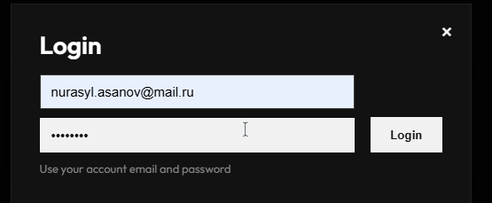
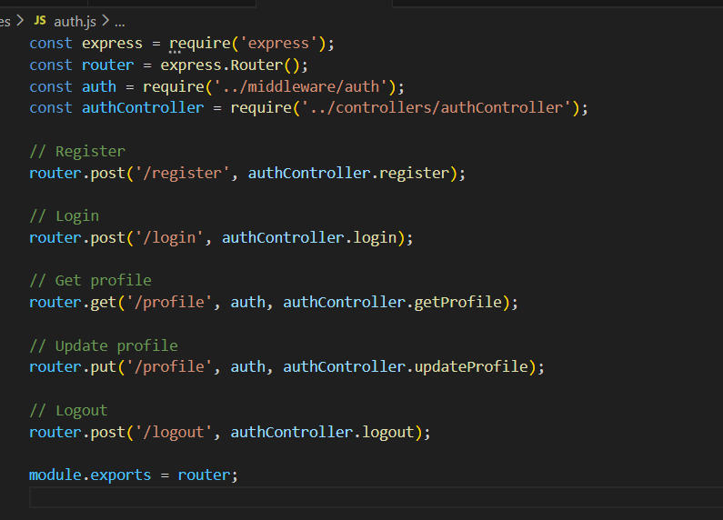
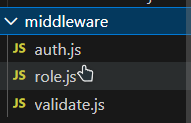

<<<<<<< HEAD
# Restaurant Management API
A modular Node.js/Express API for restaurant management, featuring authentication, booking systems, and role-based access control.
=======
> Nurassyl:
Final Report for Backend Project
Group: Nurzhan Zhumabekov, Nurassyl Assan, Nurassyl Nygmet
Class: SE-2436
Course: Backend Development
Project Topic: Task Manager API

1. Introduction
For the final project, our team developed a backend application for task management (Task Manager API). The main goal was to build a complete REST API with user registration and login, task management, protected private routes, input validation, error handling, and deployment.
>>>>>>> 083de54 (added readme)


2. Project Goals and Objectives
Goals:

strengthen practical skills in Node.js and Express;
implement secure authentication using JWT;
store and manage data with MongoDB;
demonstrate team collaboration and full system understanding.
Objectives:

<<<<<<< HEAD
1.  **Clone the repository**.
2.  **Install dependencies**:
    ```bash
    npm install
    ```
3.  **Run the server**:
    ```bash
    npm start
    ```
=======
build a modular architecture;
implement public and private API endpoints;
add validation and global error handling;
deploy the project to cloud hosting;
implement advanced features (RBAC and SMTP).
3. Technologies Used
Node.js
Express.js
MongoDB + Mongoose
JWT (jsonwebtoken)
bcrypt for password hashing
Joi / validator.js for validation
Nodemailer + SMTP provider (SendGrid/Mailgun/Postmark)
dotenv for environment variables
Render / Replit / Railway for deployment

>>>>>>> 083de54 (added readme)

4. Project Architecture
The project follows a modular structure:

routes/ — API routes
controllers/ — business logic
models/ — MongoDB models
middleware/ — JWT verification, roles, error handling
config/ — DB and environment configuration
README.md — setup steps, API docs, screenshots
This structure makes the project easier to maintain, test, and scale.


5. Database Design
We used two main collections:

User
username
email
password (stored as hash)
role
createdAt
Task
title
description
status (new/in_progress/completed)
dueDate
owner (reference to User)
createdAt
Relationship: one user can have many tasks.


6. Implemented API Endpoints
6.1 Public Endpoints (Authentication)
POST /register — register a new user, password is hashed with bcrypt.
POST /login — authenticate user and return JWT token.


6.2 Private Endpoints (User Management)
GET /users/profile — get current user profile.
PUT /users/profile — update user profile (username/email).

6.3 Private Endpoints (Task Management)
POST /tasks — create a task.
GET /tasks — get all tasks for logged-in user.
GET /tasks/:id — get task by ID.
PUT /tasks/:id — update task.
DELETE /tasks/:id — delete task.


7. Authentication and Security
JWT is used for private route protection.
Middleware verifies token validity.
Passwords are stored only as hashed values (bcrypt.hash).
Sensitive values (MONGO_URI, JWT_SECRET, SMTP API key) are stored in .env.
Additional security includes validation and access control checks.


8. Validation and Error Handling
Validation is implemented for:

email;
password;
task fields (title, etc.).
Error handling returns meaningful status codes:

400 — bad request;
401 — unauthorized;
404 — not found;
500 — internal server error.
A global error handler is implemented for consistent API responses.


9. Deployment
The project was deployed on a cloud platform (Render/Replit/Railway).
After deployment, we tested key endpoints, MongoDB connection, and environment variables.

Deployed URL: (insert your deployed link here)


10. Advanced Features
10.1 RBAC
Roles implemented: admin, user (and optionally moderator / premium user).
Access rules:

admin can delete any task;
user can manage only their own tasks.


> Nurassyl:
10.2 SMTP Integration
Nodemailer was integrated with an SMTP provider.
We implemented email sending (for example, welcome email after registration or notification email).

11. Team Contribution
Nurzhan Zhumabekov: API design, part of controllers and routes.
Nurassyl Assan: JWT authentication, security, deployment.
Nurassyl Nygmet: MongoDB models, validation, error handling, SMTP integration.
All members contributed to testing and defense preparation.

12. Conclusion
Our team built a complete backend system that meets final project requirements. We implemented modular architecture, secure authentication, MongoDB integration, CRUD endpoints, validation, global error handling, deployment, and advanced features. The project is ready for final defense and future improvements.
