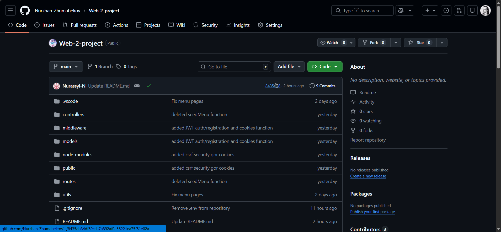
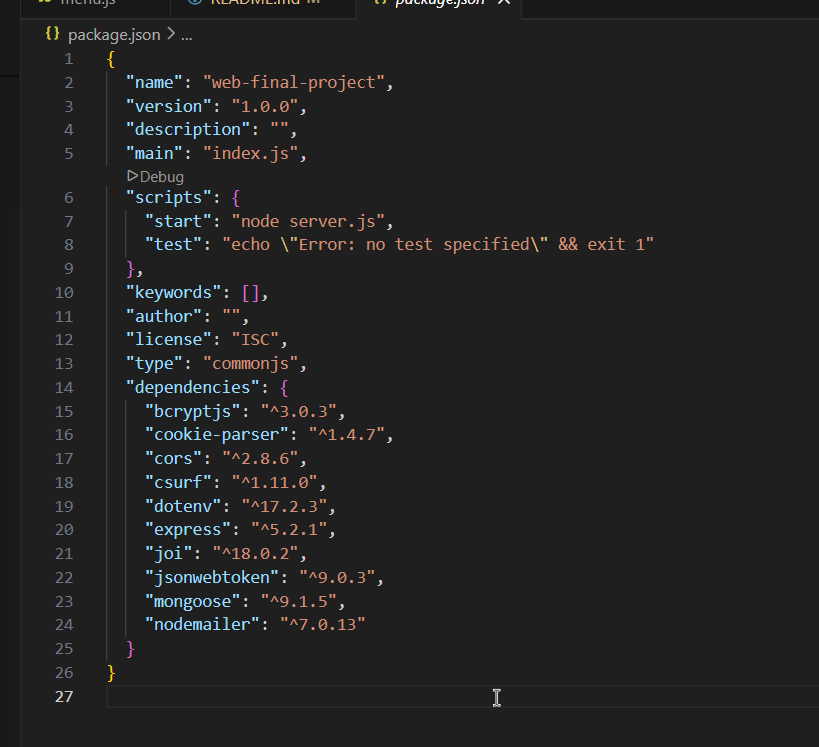
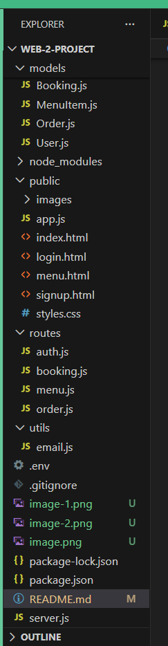
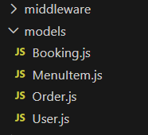
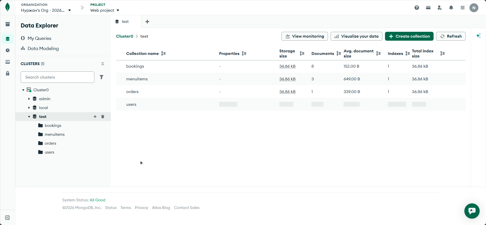
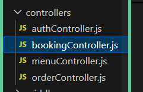
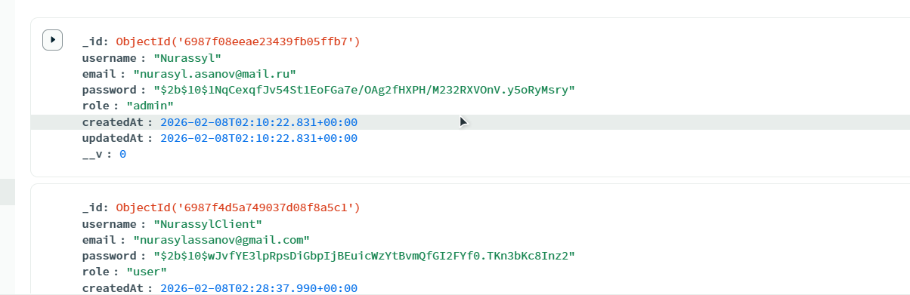

# Backend Final Project Report

Group: Nurzhan Zhumabekov, Nurassyl Assan, Nurassyl Nygmet  
Class: SE-2436  
Course: Backend Development  
Project Topic: Restaurant App API

## 1. Introduction
For the final project, our team developed a backend application for restaurant management (Restaurant App API). The goal was to build a complete REST API with authentication, menu management, bookings, orders, protected routes, validation, error handling, and deployment.

## 2. Project Goals and Objectives
Goals:
- strengthen practical skills in Node.js and Express;
- implement secure authentication using JWT;
- store and manage data with MongoDB;
- demonstrate team collaboration and full system understanding.

Objectives:
- build a modular architecture;
- implement public and private API endpoints;
- add validation and global error handling;
- deploy the project to cloud hosting;
- implement advanced features (RBAC and SMTP).

## 3. Technologies Used
- Node.js
- Express.js
- MongoDB + Mongoose
- JWT (`jsonwebtoken`)
- `bcryptjs` for password hashing
- Joi for validation
- Nodemailer + SMTP provider
- dotenv for environment variables
- Render for deployment

## 4. Project Architecture
The project follows a modular structure:
- `src/routes` - API routes
- `src/controllers` - business logic
- `src/models` - MongoDB models
- `src/middleware` - JWT verification, roles, validation, error handling
- `src/public` - frontend pages and static assets
- `README.md` - setup steps, API docs, screenshots

This structure makes the project easier to maintain, test, and scale.

## 5. Database Design
We used four main collections:

User:
- username
- email
- password (stored as hash)
- role (`admin` / `user`)
- createdAt

MenuItem:
- name
- description
- price
- category
- image
- isAvailable
- createdAt

Booking:
- user (reference to User)
- date
- time
- guests
- status
- createdAt

Order:
- user (reference to User)
- items (menu item + quantity)
- totalAmount
- address
- phone
- paymentMethod
- status
- createdAt

Relationships:
- one user can create many bookings;
- one user can create many orders;
- one order contains multiple menu items.

## 6. Implemented API Endpoints
### 6.1 Public Endpoints (Authentication)
- `POST /api/auth/register` - register a new user, password is hashed with bcrypt.
- `POST /api/auth/login` - authenticate user and return JWT token.
- `POST /api/auth/logout` - logout user and clear auth cookie.

### 6.2 Private Endpoints (Profile and Menu)
- `GET /api/auth/profile` - get current user profile.
- `PUT /api/auth/profile` - update current user profile.
- `GET /api/menu` - get available menu items.
- `GET /api/menu/admin` - get full menu list (admin only).
- `POST /api/menu` - create menu item (admin only).
- `PUT /api/menu/:id` - update menu item (admin only).
- `DELETE /api/menu/:id` - delete menu item (admin only).

### 6.3 Private Endpoints (Bookings and Orders)
- `POST /api/bookings` - create booking.
- `GET /api/bookings` - get bookings (user/admin rules apply).
- `PUT /api/bookings/:id` - update booking.
- `DELETE /api/bookings/:id` - delete booking.
- `POST /api/orders` - create order.
- `GET /api/orders` - get orders (user/admin rules apply).
- `PUT /api/orders/:id` - update order status.
- `DELETE /api/orders/:id` - delete order.

## 7. Authentication and Security
- JWT is used for private route protection.
- Token is stored in `httpOnly` cookie and verified in middleware.
- Passwords are stored only as hashed values (`bcrypt.hash`).
- Sensitive values (`MONGODB_URI`, `JWT_SECRET`, SMTP credentials) are stored in `.env`.
- CSRF protection is enabled for non-GET API requests.
- Role-based checks restrict admin-only actions.

## 8. Validation and Error Handling
Validation is implemented for:
- auth input fields (email/password/username);
- booking and order payloads;
- menu data fields.

Error handling returns meaningful status codes:
- `400` - bad request;
- `401` - unauthorized;
- `403` - forbidden;
- `404` - not found;
- `500` - internal server error.

A global error handler is implemented for consistent API responses.

## 9. Deployment
The project was deployed on Render. After deployment, we tested key endpoints, MongoDB connection, environment variables, and role-based access.

Deployed URL: https://web-2-project-2.onrender.com

## 10. Advanced Features
### 10.1 RBAC
Roles implemented: `admin`, `user`.

Access rules:
- admin can manage menu, orders, and bookings from admin panel;
- user can create and manage only their own bookings/orders.

### 10.2 SMTP Integration
Nodemailer was integrated with an SMTP provider. We implemented sending a confirmation email after successful registration.

## 11. Team Contribution
- Nurzhan Zhumabekov: API design, part of controllers and routes.
- Nurassyl Assan: JWT authentication, security, deployment.
- Nurassyl Nygmet: MongoDB models, validation, error handling, SMTP integration.

All members contributed to testing and defense preparation.

## 12. Conclusion
Our team built a complete backend system for a Restaurant App. We implemented modular architecture, secure authentication, MongoDB integration, menu/booking/order APIs, validation, global error handling, deployment, and advanced features.
